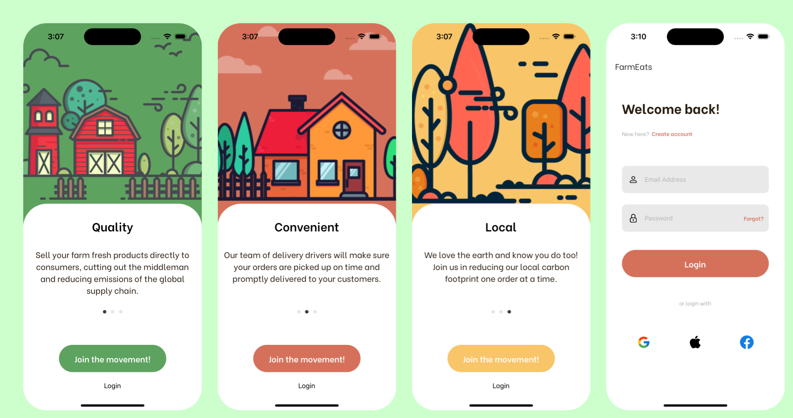

# FarmEats - Simple iOS app for Login and Signup using Swift.
FarmEats is a demo application for techwink interview.

## Preview

##Requirements
- macOS
- Xcode
- Simulator or iPhone

##Tested Configurations
- MacOS Monterey (version 12.3)
- Xcode (version 13.2.1 (13C100))
- iOS 13.0 (only tested on iPhone 11 | did not tested on any other phone varient)

##Easiest way to run the application
- Download ZIP
- Extract file
- Open Texliv folder
- Double Tap file named Texliv.xcodeproj (xcode must be installed)
- Select simulator to run (iPhone 11)
- Then hit run button
- Once app is loaded on simulator you are good to go on testing.
